# Penjelasan Autentikasi Google
1. Inisialisasi Firebase dan Google Auth
   - Firebase diinisialisasi dengan konfigurasi proyek.
   - GoogleAuthProvider digunakan untuk menangani autentikasi Google.
2. Login dengan Google
   - Aplikasi menggunakan <i>plugin</i> Google Auth untuk membuka dialog login Google.
   - <b>idToken</b> yang diterima digunakan untuk membuat <i>credential</i> login Firebase.
3. Mengambil Data Pengguna
   - Setelah login, Firebase memantau perubahan data pengguna seperti autentikasi dengan `onAuthStateChanged`.
   - Jika login berhasil, aplikasi menyimpan data pengguna seperti `displayName`, `email`, dan `photoURL`.
4. Menampilkan Data Profil
   - Data pengguna yang telah disimpan dalam <i>state</i> aplikasi ditampilkan di halaman profil.
   - Jika `photoURL` tidak tersedia, aplikasi menggunakan avatar default.

## Alur Kerja
1. Pengguna menekan tombol "SIGN IN WITH GOOGLE".
2. Plugin Google Auth memunculkan dialog untuk login.
3. Setelah login berhasil, token dikirim ke Firebase untuk verifikasi.
4. Firebase menyimpan status login pengguna dan mengembalikan data profil.
5. Aplikasi membaca data profil dari Firebase dan menampilkannya di halaman profil.

## SS dan Penjelasannya
1. Login Page
   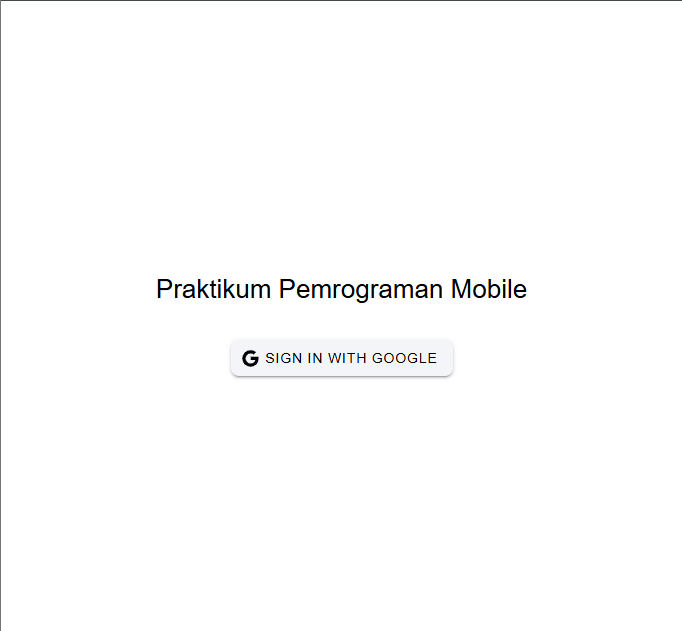
- Pengguna memulai proses login dengan menekan tombol "SIGN IN WITH GOOGLE".
2. Pilih Akun
  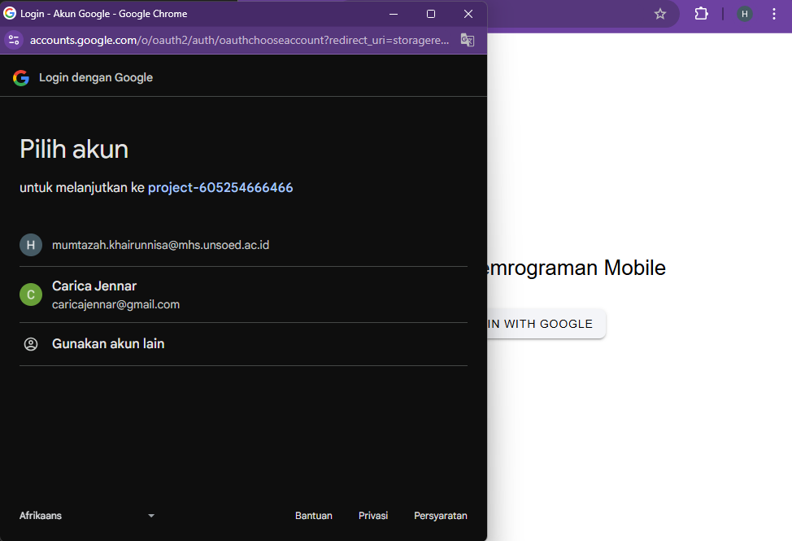
- Dialog Google muncul, meminta pengguna untuk memilih akun Google yang akan digunakan.
3. Konfirmasi
 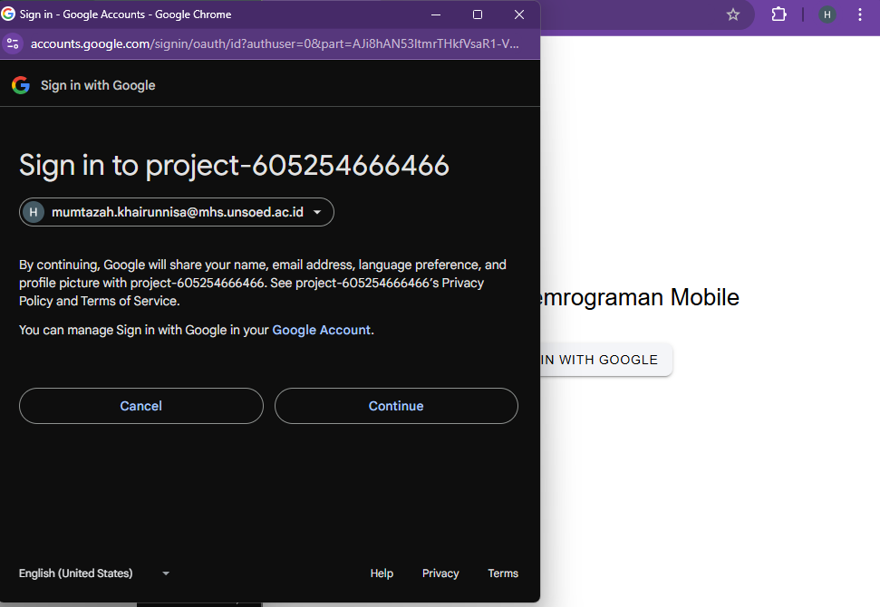
- Setelah memilih akun, muncul dialog konfirmasi sign in dari Google.
4. Home Page
 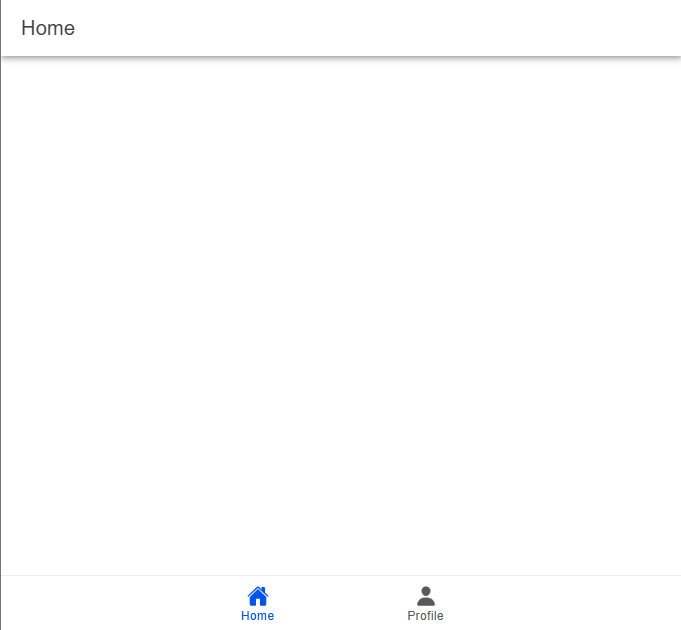
- Halaman utama aplikasi setelah login berhasil, menampilkan fitur utama aplikasi.
5. Profile Page
  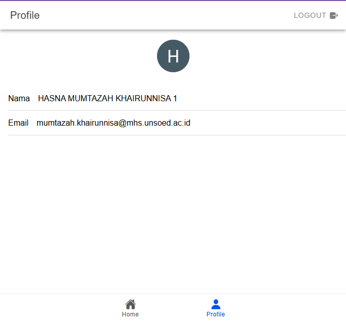
- Halaman profil yang menampilkan:
- `Nama:` diambil dari `displayName` akun Google.
- `Email`: diambil dari `email` akun Google.
- `Foto Profil`: diambil dari `photoURL` akun Google.

## Fitur CRUD

1. Add (Create) Todo
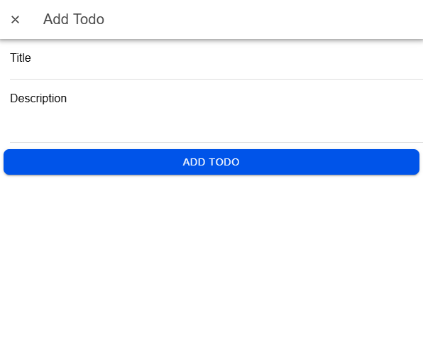
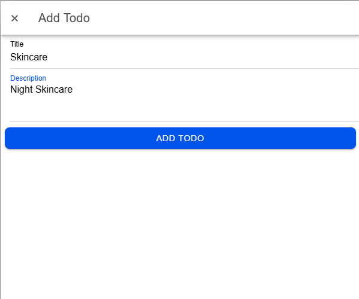
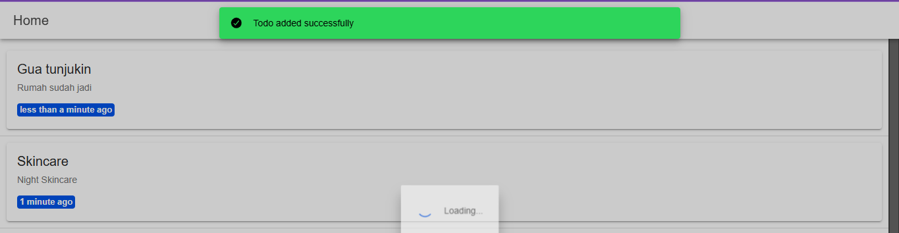
Pada fitur ini, user bisa menambahkan todo baru dengan memasukkan judul dan deskripsinya. Status default dari todo ini adalah `not completed`.
3. Read Todo

Fitur ini menampilkan daftar todo berdasarkan waktu update terbaru dalam dua kategori, yaitu aktif dan selesai.
5. Update Todo
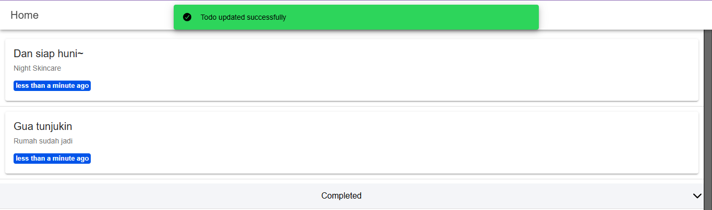
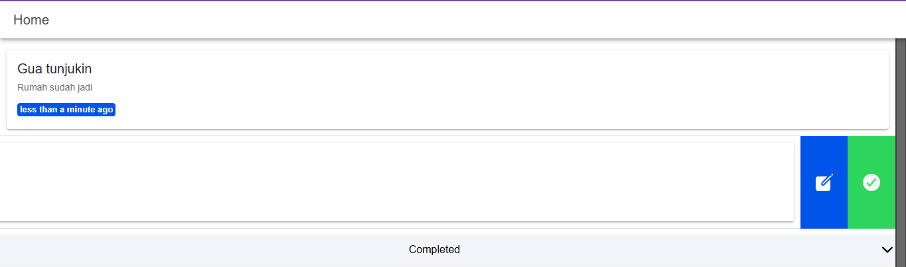
User bisa memperbarui judul dan deskripsi todo yang sudah ada melalui tombol berikon `Edit` pada kotak todo. Untuk memunculkan tombolnya, geser kotak ke kiri.
7. Delete Todo
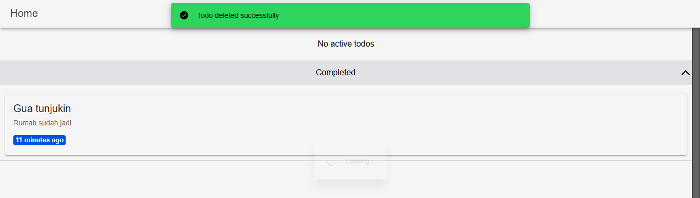
User bisa menghapus todo yang tidak diperlukan lagi dengan menekan tombol berikon tempah sampah. Caranya adalah dengan menggeser kotak ke kanan.
9. Completed Todo

Jika todo sudah dikerjakan, user bisa menandainya sebagai completed. Caranya adalah dengan menggeser kotak ke kiri dan menekan tombol berwarna kuning.
## Hasna Mumtazah Khairunnisa | H1D022070 | Shift E
